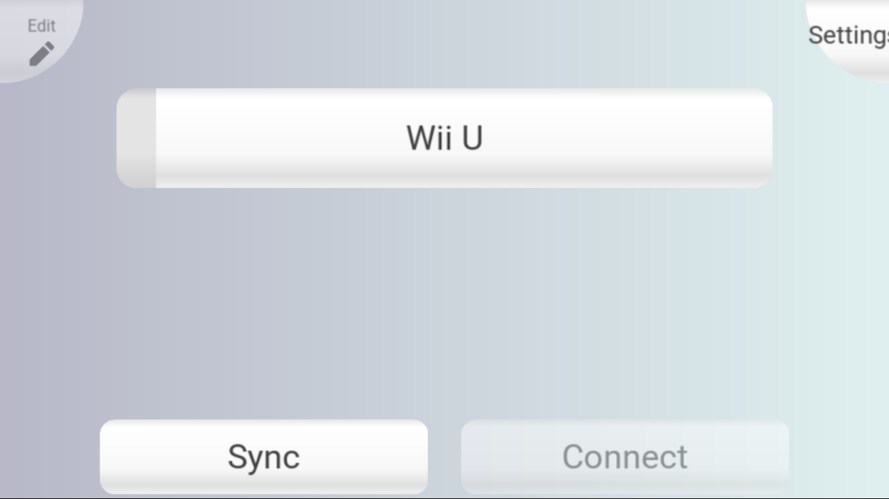
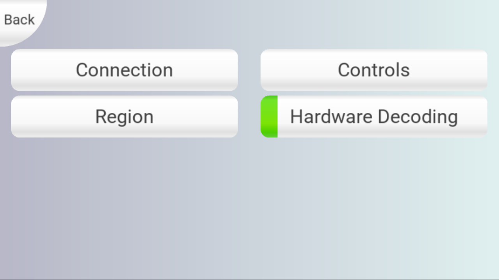
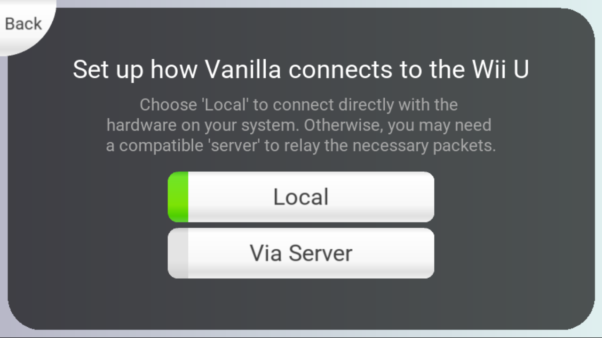
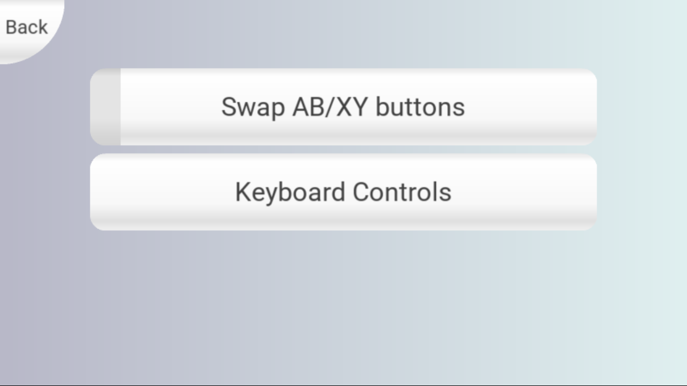
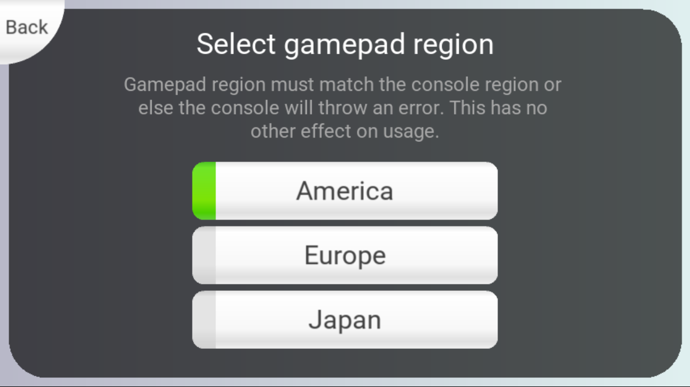
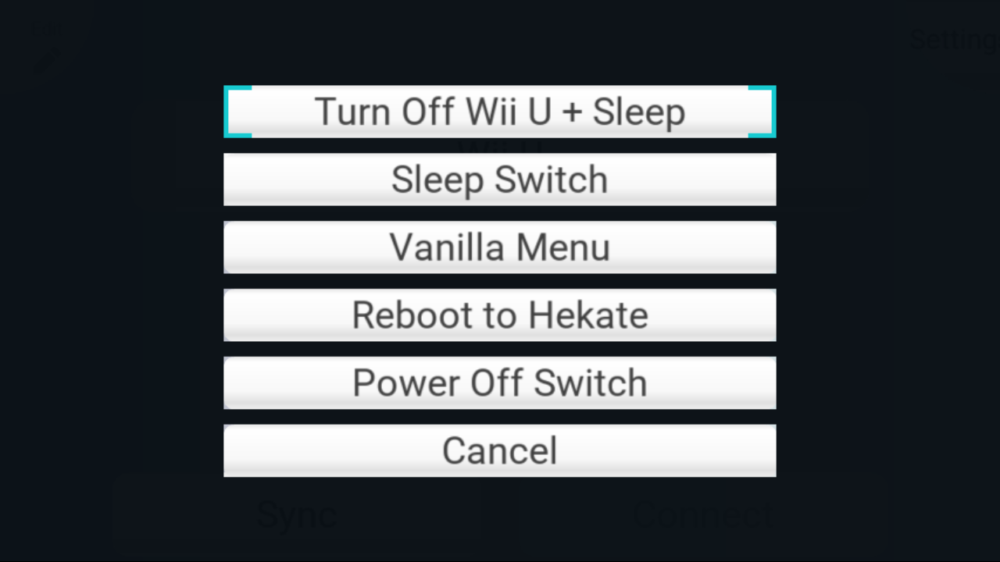

# vanilla switch wii u gamepad

Use a Nintendo Switch or Nintendo Switch Lite as a Wii U GamePad with Vanilla.

This fork is focused on making Vanilla feel native and practical on Nintendo Switch hardware, with Switch-specific power management, screenshots, region defaults, and a ready-to-use release build.

> **Tested on Nintendo Switch Lite.**
>
> Regular Nintendo Switch support is included in the build, but has not been personally tested yet.

---

## features

- Use a Nintendo Switch or Switch Lite as a Wii U GamePad
- Local direct connection to the Wii U
- Touchscreen support
- Hardware decoding
- Wii U GamePad controls
- Region selection
  - America
  - Europe
  - Japan
- America selected by default
- Quiet boot
- Custom Switch power menu
- Turn off the Wii U and sleep the Switch together
- Sleep the Switch
- Return to the Vanilla menu
- Reboot directly to Hekate
- Power off the Switch
- Built-in screenshot support
- Switch Lite charger-wake fix
- Persistent settings and screenshots on the SD card

---

## download

Download the latest release from the **Releases** page:

**`vanilla-switch-wiiu-gamepad-v1.0.zip`**

Use the release ZIP, not GitHub's automatically generated source code ZIP.

---

## requirements

- Modded Nintendo Switch or Nintendo Switch Lite
- Hekate
- SD card
- Wii U console
- Wii U must be powered on for syncing and connection

---

## installation

The release ZIP contains:

- `bootloader/`
- `switchroot/`

To install:

1. Download the latest release ZIP
2. Extract it
3. Copy the included `bootloader` and `switchroot` folders to the root of your Switch SD card
4. Merge folders if prompted
5. Boot Vanilla from Hekate

Backing up your SD card first is recommended.

---

## main screen

From the main screen you can:

- Sync a Wii U
- Connect to a previously synced Wii U
- Edit the saved console
- Open Settings



---

## settings

Available settings include:

- Connection
- Region
- Controls
- Hardware Decoding



---

## connection

For a normal direct Wii U connection, use:

- **Local**

The **Via Server** option is still available for setups that require it.



---

## controls

Control settings include:

- Swap AB/XY buttons
- Keyboard controls



---

## region

The GamePad region must match the Wii U console region.

Available regions:

- America
- Europe
- Japan

America is selected by default in this build.



---

## power menu

Long-press the Switch power button while Vanilla is running to open the custom power menu.

Available options:

- **Turn Off Wii U + Sleep**
  - Sends the Wii U GamePad power command
  - Returns Vanilla to the main menu
  - Puts the Switch to sleep

- **Sleep Switch**
  - Puts the Switch to sleep

- **Vanilla Menu**
  - Returns to the Vanilla main menu

- **Reboot to Hekate**
  - Reboots directly back to Hekate

- **Power Off Switch**
  - Fully powers off the Switch

- **Cancel**
  - Closes the power menu



---

## screenshots

Vanilla includes built-in screenshot support on Switch.

Press:

**L3 + R3**

Screenshots are saved as PNG files in:

`/switchroot/vanilla/screenshots/`

Example:

`vanilla-0001.png`

The shortcut only works while Vanilla is running.

---

## switch lite sleep behavior

This build includes a Switch Lite-specific suspend modification.

While Vanilla is asleep:

- Pressing the physical power button wakes the Switch
- Connecting a charger does not wake the Switch
- Disconnecting a charger does not wake the Switch
- Charging continues normally while asleep

This modification only targets the Switch Lite / Vali device tree.

---

## keyboard shortcuts

Extra Vanilla functions are still available through keyboard shortcuts.

| Function | Key |
| --- | --- |
| Start/Stop Recording | F5 |
| Toggle Fullscreen | F11 |
| Take Screenshot | F12 |
| Disconnect | Esc |

---

## keyboard gameplay controls

A controller is recommended, but Vanilla also supports keyboard input.

| GamePad Button | Key |
| --- | --- |
| A | Z |
| B | X |
| X | C |
| Y | V |
| Plus (+) | Enter / Return |
| Minus (-) | Left Ctrl |
| Home | H |
| TV | Y |
| Left Stick Up | W |
| Left Stick Left | S |
| Left Stick Down | A |
| Left Stick Right | D |
| Left Stick Click | E |
| D-Pad Up | Up Arrow |
| D-Pad Left | Left Arrow |
| D-Pad Down | Down Arrow |
| D-Pad Right | Right Arrow |
| Right Stick Up | Keypad 8 |
| Right Stick Left | Keypad 4 |
| Right Stick Down | Keypad 2 |
| Right Stick Right | Keypad 6 |
| Right Stick Click | Keypad 5 |
| L | T |
| ZL | G |
| R | U |
| ZR | J |

---

## building from source

This repository contains the complete source used for the release build.

The Switch build process includes the current Switch-specific modifications automatically, including:

- power menu integration
- Wii U power-button handling
- modal power-menu controls
- region ordering and default region
- quiet boot
- screenshot support
- Switch Lite charger-wake behavior

For general Linux compilation, Vanilla uses a standard CMake build process.

```sh
git clone https://github.com/pboyer86/vanilla.git
cd vanilla
mkdir build && cd build
cmake ..
cmake --build . --parallel

---

## upstream / credits

This project is based on the original **Vanilla** Wii U GamePad project:

[vanilla-wiiu/vanilla](https://github.com/vanilla-wiiu/vanilla)

Credit goes to the original Vanilla developers and contributors for the core Wii U GamePad implementation.

This fork focuses on the Nintendo Switch experience and adds Switch-specific power management, screenshots, region defaults, sleep behavior, and other quality-of-life improvements.
